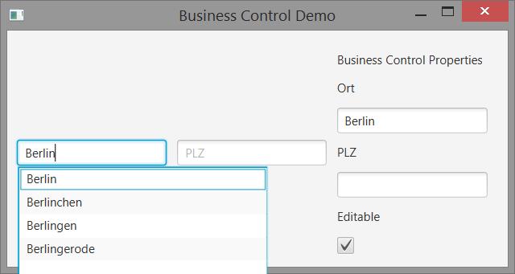

= JavaFX Business Control for City and Postcode Selection

Cities and postcodes have a `1 to n` relation.
In order to help display and select these to values, I developed a custom JavaFX business control.

Furthermore, this project showcases the powerful "skin", "control" and "binding" concepts of JavaFX.

[NOTE]
====
This project was part of an assignment of the https://www.fhnw.ch/de/studium/module/9200607[CUIE lecture]
at https://www.fhnw.ch[FHNW] by https://github.com/DieterHolz[@DieterHolz].
====

== Features

* Filtering
* Validation
* CSS pseudo classes for invalid state
* Read-only view
